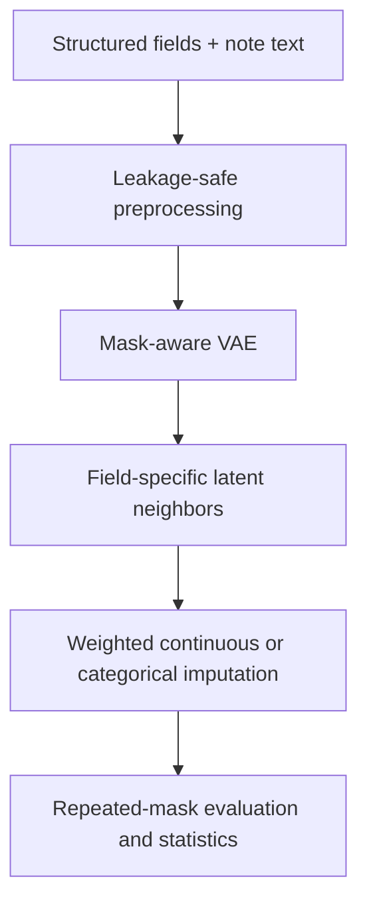

# Similarity-Augmented VAE for EHR Missing-Value Imputation

Reproducible Python code accompanying the manuscript:

> **Similarity-Augmented Variational Autoencoder for Missing Value Imputation
> in Electronic Health Records: Evaluation on MIMIC-IV and Real-World
> Ophthalmology Records**

The repository implements a mask-aware Variational Autoencoder (VAE), explicit
patient-similarity weighting in the learned latent space, mixed continuous and
categorical evaluation, patient-disjoint splitting, controlled MCAR/MAR/MNAR
test masking, ablations, baseline comparisons, efficiency measurements, and
seed-level paired Wilcoxon tests, cluster-bootstrap intervals, and Holm
correction.

## Reproducibility status

The code and synthetic smoke test are executable. The supplied manuscript
materials did **not** include the underlying MIMIC-IV/BioArc extracts, trained
checkpoints, fixed clinical evaluation masks, per-seed predictions, or original
profiler logs. Therefore:

- the checked-in smoke results use **synthetic, non-clinical data**;
- they verify software behavior, not scientific performance;
- manuscript numbers are recorded in
  [`paper_reference_results.json`](paper_reference_results.json) as
  **reported but not independently reproduced**;
- no real patient data or protected health information is included.

### Descriptive results reported in the supplied manuscript

| Dataset | Unit | Reported accuracy | Reported macro-F1 | Reported standardized RMSE | Status here |
|---|---|---:|---:|---:|---|
| MIMIC-IV | 10,000 admissions / 8,214 patients | 85% | 83% | 0.640 | Documentary only |
| BioArc | 10,000 visits / 6,782 patients | 88% | 86% | 0.560 | Documentary only |

The manuscript describes an 80/10/10 patient-disjoint split, ten declared
masking seeds, and MCAR/MAR/controlled-MNAR evaluation at 10%, 20%, and 30%.
The headline table values are for 20% controlled MNAR. The clinical prediction
files needed to verify those summaries are not public. The reported values are
preserved in
[`paper_reference_results.json`](paper_reference_results.json).

The manuscript also reported a BioArc query time of 0.5 s and RAM use of
7.1 GB. Those values cannot be verified without the original environment and
input data.

## Method



For patient \(i\), the encoder maps the masked structured input, observation
mask, and optional text vector to posterior mean \(\mu_i\) and variance. The
training objective combines observed-entry reconstruction with KL
regularization:

\[
\mathcal{L}
=
\mathcal{L}_{\mathrm{continuous}}
+\mathcal{L}_{\mathrm{categorical}}
+\beta D_{\mathrm{KL}}
\left(q_\phi(z\mid x,r)\,\|\,\mathcal{N}(0,I)\right).
\]

Cosine similarity is computed from deterministic posterior means:

\[
s_{ij}
=
\frac{\mu_i^\top\mu_j}
{\|\mu_i\|_2\|\mu_j\|_2+\epsilon}.
\]

For target \(d\), only training donors with an observed \(x_{jd}\) are eligible.
Top-\(k\) similarities are normalized with a temperature-softmax:

\[
w_{ij}^{(d)}
=
\frac{\exp(s_{ij}/\tau)}
{\sum_{\ell\in\mathcal{N}_k^{(d)}(i)}\exp(s_{i\ell}/\tau)}.
\]

Continuous values use a weighted mean of **observed donor values**:

\[
\hat{x}_{id}
=
\sum_{j\in\mathcal{N}_k^{(d)}(i)}w_{ij}^{(d)}x_{jd}.
\]

Categorical fields use weighted class probabilities followed by `argmax`. The
implementation deliberately uses \(x_{jd}\), not \(z_{j,d}\): a latent
coordinate is not the observed clinical field.

## Implemented experiments

- Mask-aware NumPy VAE with:
  - mixed continuous-MSE and categorical-cross-entropy reconstruction;
  - reparameterization and KL loss;
  - denoising corruption;
  - Adam, gradient clipping, validation early stopping.
- Proposed latent-neighbor SA-VAE.
- Plain decoder-based VAE.
- Structured-only versus structured-plus-text ablation.
- Mean/mode imputation.
- Raw-space k-nearest neighbors.
- Random Forest, one model per target.
- Histogram Gradient Boosting, one model per target.
- Optional XGBoost (`requirements-full.txt`).
- Hashing text encoder for deterministic tests.
- Optional frozen ClinicalBERT backend (`requirements-full.txt`).
- Artificial MCAR, observed-driver MAR, and value-dependent MNAR masks.
- Accuracy, macro-precision, macro-recall, and macro-F1 for categorical fields.
- MAE and RMSE for continuous fields.
- Paired two-sided Wilcoxon tests with Holm correction.
- Training/inference timing, parameter counts, and process peak RSS.
- Donor-level explanations containing similarities, normalized weights, and
  observed donor values.
- Diagnostic two-dimensional PCA visualization of VAE posterior means; it is
  not presented as evidence of clinical interpretability.
- Training and inference efficiency plots.
- Multiple masking rates and explicit masking-seed lists in one run.
- Optional declared weights for standardized MAR drivers.
- Seed-level aggregation before Wilcoxon testing, plus a masking-seed cluster
  bootstrap interval.

GAIN and MIWAE are not silently approximated. They were requested by reviewers,
but validated implementations and run-level outputs were not present in the
archived study package. Add validated implementations before retaining an
empirical claim involving those methods.

## Quick start

Python 3.10 or newer is required.

```bash
python3 -m venv .venv
source .venv/bin/activate
python3 -m pip install -r requirements.txt
bash scripts/smoke_test.sh
```

The smoke command:

1. compiles all Python modules;
2. runs the standard-library unit/integration tests;
3. trains the NumPy VAE and its structured-only ablation;
4. evaluates eight executable methods under MCAR, MAR, and MNAR masks;
5. verifies metric ranges, method coverage, normalized donor weights, patient
   partition counts, statistical p-values, metadata consistency, and all
   required CSV/JSON/PNG artifacts.

To run only the experiment:

```bash
PYTHONPATH=src python3 scripts/run_experiment.py \
  --config configs/smoke.yaml
```

After editable installation, the same workflow is available through the CLI:

```bash
python3 -m pip install -e .
savae validate --config configs/smoke.yaml
savae run --config configs/smoke.yaml
```

## Repository layout

```text
.
├── configs/
│   ├── smoke.yaml
│   └── paper_experiment_template.yaml
├── data/
│   ├── README.md
│   └── schema.example.yaml
├── docs/
│   ├── data_contract.md
│   └── methods.md
├── results/smoke/
├── scripts/
│   ├── generate_synthetic.py
│   ├── run_experiment.py
│   └── smoke_test.sh
├── src/savae/
└── tests/
```

## Running MIMIC-IV or BioArc experiments

1. Obtain authorized, de-identified data. Do not commit it.
2. Create one YAML file per dataset by copying
   [`configs/paper_experiment_template.yaml`](configs/paper_experiment_template.yaml).
3. Replace every `REPLACE_...` value with the exact extraction/schema details.
4. List the exact evaluated targets and MAR driver variables.
5. Verify that `emilyalsentzer/Bio_ClinicalBERT`, segment-mean pooling, and the
   note index-time cutoff match the clinical run.
6. Install optional dependencies if ClinicalBERT or XGBoost is enabled:

   ```bash
   python3 -m pip install -r requirements-full.txt
   ```

7. Run each dataset:

   ```bash
   savae run --config configs/mimic_iv.yaml
   savae run --config configs/bioarc.yaml
   ```

The expected CSV contract is described in
[`docs/data_contract.md`](docs/data_contract.md).

## Leakage controls

- Splitting is performed by `patient_id`; one patient cannot cross partitions.
- Preprocessing statistics and categorical vocabularies are fitted on training
  data only.
- Natural missing values are inputs but are never scored without ground truth.
- Evaluation masks hide only originally observed test entries.
- Every method receives the same split and evaluation mask.
- For target \(d\), the target is masked from both query and donor
  representations before distance/latent-neighbor selection.
- Test donors come only from the training partition.
- Categorical and continuous metrics remain separate.

## Output files

Each run writes:

- `cohort_summary.json`
- `config_resolved.yaml`
- `efficiency.csv`
- `efficiency_profile.png`
- `latent_space_pca.png`
- `masking_metadata.json`
- `metrics_long.csv`
- `metrics_summary.csv`
- `metrics_summary.png`
- `neighbor_explanations.json`
- `preprocessor_metadata.json`
- `run_metadata.json`
- `statistical_tests.csv`
- `training_history.csv`
- `training_history_structured.csv` when ablation is enabled

`run_metadata.json` records package versions and explicitly labels synthetic
output so it cannot be mistaken for the manuscript's clinical results.

## Scientific limitations

- A synthetic smoke test cannot validate clinical utility.
- Naturally missing values do not have directly observable ground truth.
- Implemented MNAR is a declared value-dependent simulation, not identification
  of the natural EHR missingness process.
- The public reference implementation is a dependency-light NumPy VAE and is
  not represented as the archived PyTorch clinical-analysis implementation.
- A note-level index-time cutoff must be enforced upstream; otherwise direct
  mention of the hidden target in post-index text can cause leakage.
- MIMIC-IV critical-care data and one ophthalmology setting do not establish
  universal generalizability.
- Donor visibility is procedural transparency, not a causal clinical
  explanation.

## Testing

```bash
make check
```

or:

```bash
PYTHONPATH=src python3 -m unittest discover -s tests -v
PYTHONPATH=src python3 scripts/run_experiment.py --config configs/smoke.yaml
```

GitHub Actions repeats both commands on every push and pull request.

## Repository

The canonical public repository is
<https://github.com/tanhaei/SA-VAE>.

## License

Code is released under the MIT License. Dataset licenses and institutional
governance remain separate and must be respected.
